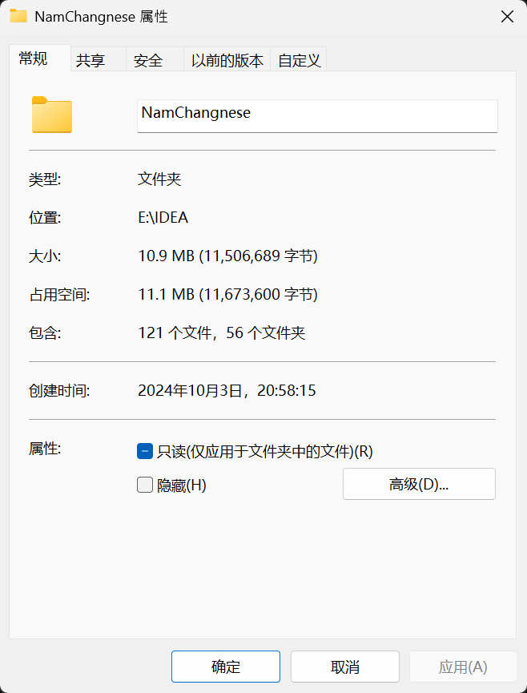

# 豫章词 —— 方言词典和学习软件

## 介绍

### 目的

尝试使用编程能力实现一个完整的方言词典

### 相关内容

<a href="https://github.com/Yau-ShuoWen/Lexicon-of-Yuzhang-Android">安卓应用程序正在开发（进入）</a>

<a href="https://github.com/Yau-ShuoWen/Lexicon-of-Yuzhang-Web" target="_blank">网站前端正在开发（进入）</a>


## 历程

创建于2024/10/03



- [历史版本演进](./docs/历史.md)

## 文档

- [结构和命名](./docs/name)
- [应用程序接口](./docs/api)
- [类的设计](./docs/class)
- [数据库设计](./docs/database)

## 代码相关

### 代码目录

详细内容见 [代码包结构](./docs/name/代码包结构.md)
```
com/shuowen/yuzong/
│
├── config/       配置文件
├── controller/   控制层
├── data/         数据层
├── Linguistics/  语言学内容
├── service/      服务层
└── Tool/         工具类
```


### 提交记录符号说明

- 1️⃣ 排列：关于一次提交不同模块之间的大标题符号
- 📖 新学：如果用到了新学习的系统的知识完成，**学习小的用法不算**
- 📤 新增：新增了一个**完整的**功能或者类
- ✏️ 修改：对于不完整的类新增一部分代码，**补充业务流程**
- 🪛 重构：对于已经提交的代码换一种新的方式实现，**修改业务流程，不大改结果**
- 🗑️ 删除：对于过时的功能的删除，**不会保留备份**，如果需要请检查历史提交记录
- 🐛 揥蚆蛒：戏称debug，修改了一个**已经提交的**代码但是出问题的点
- 🚀 重大更新：一般不会出现，如果因为**客观原因**长期写了代码没提交（数据库崩溃、无法测试等），整理的时候会标注
- 🗃️ 杂项更新：一些小功能的更新，或者补充一些被漏的提交，或者整理代码
- 📁 文档：撰写文档提交
- 🌱 经验：**不会出现在标题上**，在编码过程中比较重要的经验
- 🎉 新版本：一般不会出现，因为后端一般不会分发
- 🧪 测试功能新版本：一般不会出现，因为后端一般不会分发