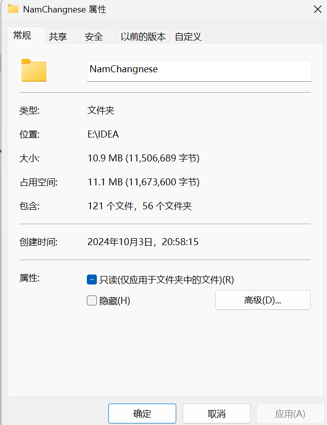

# 豫章词 —— 方言词典和学习软件

## 介绍

### 目的：尝试使用编程能力实现一个完整的方言词典

### 其他内容

<a href="https://github.com/Yau-ShuoWen/Lexicon-of-Yuzhang-Android">安卓应用程序正在开发（进入）</a>

<a href="https://github.com/Yau-ShuoWen/Lexicon-of-Yuzhang-Web" target="_blank">网站前端正在开发（进入）</a>


## 历程




## 代码相关

### 代码目录
```
com/shuowen/yuzong/
│
├── Linguistics/    语言学内容
│   ├── Format/     方言拼音格式
│   ├── Mandarin/   普通话内容
│   └── Scheme/     方言拼音方案
│
├── Tool/
│   ├── dataStructure/   自己做的数据结构
│   └── format/          和文件格式有关的脚本和工具
│
├── config/       配置文件
│
├── controller/   典型的控制层
│ 
├── dao/
│   ├── domain/   低级数据传输实体，用于在服务层处理
│   ├── dto/      高级数据传输实体，用于在控制层传输   
│   ├── mapper/   数据映射类
│   └── model/    数据实体类
│
├── mq/           分布式消息相关
│
├── redis/        远程数据库相关
│
├── service/      典型的服务层
│   └── impl/
│
└── YuZongApplication.java
```


### 代码修改状态

- 📖 新学：如果用到了新学习的系统的知识完成，**学习小的用法不算**
- 📤 新增：新增了一个**完整的**功能或者类
- ✏️ 修改：对于不完整的类新增一部分代码，**补充业务流程**
- 🪛 重构：对于已经提交的代码换一种新的方式实现，**修改业务流程，不大改结果**
- 🐛 揥蚆蛒：戏称debug，修改了一个**已经提交的**代码但是出问题的点
- 🚀 重大更新：一般不会出现，如果因为**客观原因**长期写了代码没提交（数据库崩溃、无法测试等），整理的时候会标注
- 🗃️ 杂项更新：一些小功能的更新，或者补充一些被漏的提交
- 📁 文档：撰写文档提交
- 🌱 经验：**不会出现在标题上**，在编码过程中比较重要的经验
- 🎉 新版本：一般不会出现，因为后端一般不会分发
- 🧪 测试功能新版本：一般不会出现，因为后端一般不会分发